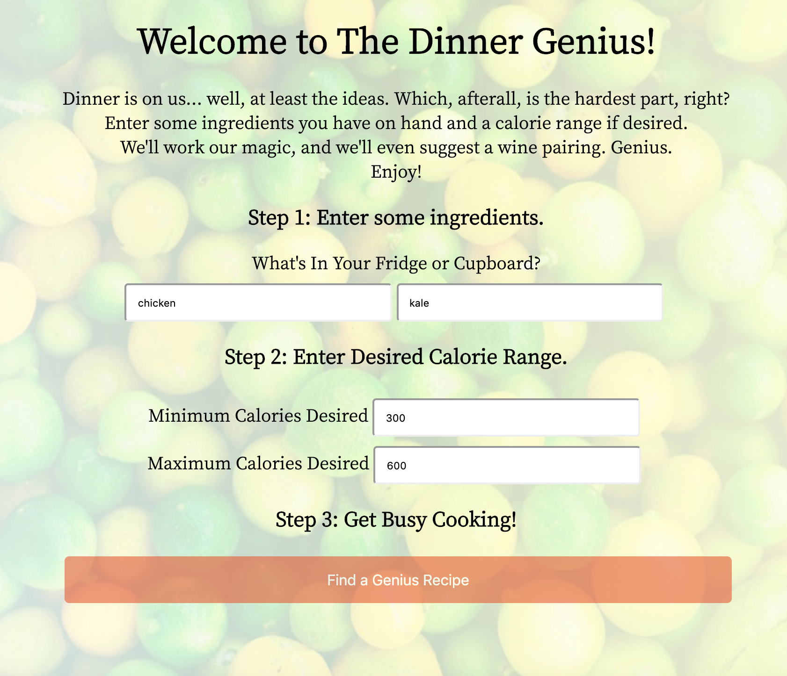

Dinner Genius App
=================

  

Motivation:  
------------
This app was created to help the user find dinner recipe ideas based on two ingredients the user has on hand.  Results can be specified to have any calorie range provider by the user.  Ten results will be displayed below the form along with a suggested wine pairing.  The app is powered by the Edamam and Spoonacular APIs. 

Key Technologies:  
----------------
-HTML
-CSS
-JavaScript
-jQuery  

Author:
----------------
Tiffany Massela

Special Acknowledgments:
------------------------
Her wonderful family of picky eaters.